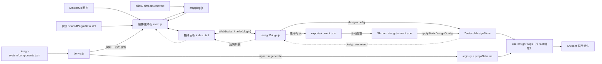

# 架构文档

> 本文档由 Codex 自动生成和维护。最后更新于：2026-08-11

## 1. 项目概述

Shroom 设计桥是一套本机设计配置同步工具，将 MasterGo 画布中的组件实例属性转换为代码侧 props，经本地 WebSocket 服务校验、原子落盘并广播到 Shroom React 前端。链路断开时，前端继续使用代码默认值；设计配置不会成为生产运行的硬依赖。

系统由三部分组成：MasterGo 桌面插件、本地 Node.js 设计桥、可复制进 Shroom 的 React/Zustand 消费层。组件清单 `design-system/components.json` 是唯一真相：MasterGo 组件属性、`shroom/contract` 和前端 registry 都由它推导，加组件只改这一处。清单对齐 `E:/ShroomSDK/UI/shroomui`，当前登记 Drawer、Select、AsyncState、ChartPanel、MetricValue、ToolbarAction、SettingControlRow、DraggablePanel 八个展示组件。除实时连接外，也支持把配置独立导出到本项目，再由用户手动复制进 Shroom 并以静态模式加载。

## 2. 技术栈

| 分类 | 技术 | 版本/说明 |
| :--- | :--- | :--- |
| **前端框架** | React + Zustand | React `>=16.8`；Zustand `>=4.5 <6` |
| **后端框架** | Node.js WebSocket 服务 | Node.js `>=18`；无 HTTP 框架 |
| **数据库** | 无 | 配置以 JSON 文件形式原子落盘 |
| **编程语言** | JavaScript、HTML、CSS、JSON | 服务使用 CommonJS；前端消费层使用 ES Modules |
| **包管理器** | npm | 根目录统一执行各子项目脚本 |
| **部署环境** | 本机桌面开发环境 | 服务仅绑定 `127.0.0.1`；插件运行于 MasterGo 桌面客户端 |
| **其他关键库** | `ws`、Node.js Test Runner | `ws ^8.18.0`；测试使用 `node:test` / `node:assert` |

## 3. 目录结构

```text
MGsdk/
├─ design-system/
│  └─ components.json        # 组件清单：唯一真相
├─ plugin/
│  ├─ src/
│  │  ├─ manifest.json       # MasterGo 插件清单
│  │  ├─ main.js             # 团队库浏览/插入、导出、槽位绑定与组件生成
│  │  ├─ mapping.js          # 契约、alias 和值类型映射引擎
│  │  ├─ derive.js           # 清单校验与「清单 → 契约/画布属性/registry」推导
│  │  └─ index.html          # 组件库浏览器、清单片段、槽位 UI 及 WebSocket 客户端
│  ├─ scripts/build.js       # 内联组件清单并生成可导入的 dist 三件套
│  ├─ test/                  # 17 项映射、15 项推导测试及构建产物运行时冒烟测试
│  └─ dist/                  # manifest.json、main.js、index.html
├─ server/
│  ├─ designBridge.js        # WebSocket 服务、校验、广播、原子落盘
│  ├─ standalone.js          # --port / --dir 独立启动器
│  └─ test/                  # 16 项服务端与协议测试
├─ shroom-patch/design/
│  ├─ designStore.js         # Zustand 连接状态、重连、配置和反向命令
│  ├─ registry.js            # 组件注册表、propsSchema 与安全回退
│  ├─ generated/components.js # 由清单生成，勿手改
│  ├─ SchemaRenderer.js      # useDesignProps、按槽位选择实例与绑定歧义告警
│  ├─ DesignBridgeIndicator.js
│  ├─ index.js               # 公共导出入口
│  └─ test/                  # 20 项前端消费层测试（含静态配置入口与槽位绑定）
├─ scripts/
│  ├─ check-export.js        # 校验手动导出的 current.json 并报告槽位绑定问题
│  ├─ check-export.test.js   # 4 项导出校验与绑定诊断测试
│  └─ generate-registry.js   # 由清单生成前端 registry，--check 做漂移检查
├─ exports/
│  └─ README.md              # 独立配置导出目录说明
├─ docs/
│  ├─ manifest.md            # 组件清单字段说明
│  ├─ contracts.example.json
│  ├─ current.example.json
│  ├─ design-config.schema.json
│  └─ protocol.md
├─ README.md
└─ package.json              # install:all / test / generate / build / verify
```

### 关键目录说明

| 目录 | 主要功能 |
| :--- | :--- |
| `/plugin` | MasterGo 插件源码、构建产物和映射测试 |
| `/server` | 本机设计桥服务、命令行入口和协议测试 |
| `/shroom-patch/design` | 复制到 `shroom/client/src/design` 的前端消费层 |
| `/exports` | 默认生成独立 `current.json`，由用户手动复制到 Shroom |
| `/scripts` | 导出配置校验、绑定诊断等根级辅助命令 |
| `/docs` | 组件清单说明、契约与配置示例、JSON Schema 与协议说明 |
| `/design-system` | 组件清单，加组件唯一需要改的地方 |

## 4. 核心模块与数据流

### 4.1 模块关系图



### 4.2 主要数据流

1. **团队库浏览与插入**
   - `mg.getTeamLibraryAsync()` 读出已订阅库的组件，`TeamLibraryComponent.cover` 直接作为面板预览图，变体成员按 `componentSetUkey` 合并进组件集卡片。
   - 点击或从面板拖到画布：`importComponentByKeyAsync(ukey)` → `createInstance()`，拖放经 `drop` 事件按落点定位并 `appendChild` 到最近容器。
   - 卡片按组件名是否在清单里标记「已映射 / 未映射」；未映射的可由 `TeamLibraryComponent.properties` 一键生成清单片段，属性名不用人工抄。
2. **清单驱动的组件登记**
   - `design-system/components.json` 声明每个组件的 prop 名、类型、代码默认值、画布属性名和枚举可变值。
   - `derive.js` 由它推导三样产物：插件创建的画布属性、写进 `sharedPluginData` 的 `shroom/contract`、前端 registry 的 `defaultProps` 与 `propsSchema`。
   - `npm run generate` 生成 `shroom-patch/design/generated/components.js`；`npm test` 用 `generate --check` 挡住手改生成物造成的漂移；`npm run build` 把清单内联进插件 bundle。
   - 契约优先取主组件 `sharedPluginData` 中的 `shroom/contract`，缺省时由清单推导。后者让团队库组件无需编辑权限即可映射。
   - 团队库组件不存在时，插件可按清单在画布上生成主组件：`createComponent` 建骨架，枚举属性经 `combineAsVariants` 建成组件集。内部是占位矩形，设计师替换视觉不影响任何绑定。
   - 清单不合法时，生成、构建和插件面板三处都拒绝执行并列出全部问题。
3. **设计配置正向同步**
   - 插件主线程读取当前页面选中的组件实例及其主组件定义。
   - 映射引擎优先使用组件属性 `alias`，其次使用 `shroom/contract.propMap`；枚举、数字和 JSON 分别由 `valueMap`、`numberProps`、`jsonProps` 转换。
   - 无法映射的属性写入 `unmapped` 并在插件面板显示警告。
   - 插件 UI 通过 WebSocket 推送 `design:config`；服务端验证 schema 1.x 后串行、原子写入 `current.json`，再广播给所有前端连接。
   - 前端 Store 保存最新配置；`useDesignProps` 选择实例，经注册表校验后覆盖代码默认值。
4. **实例绑定（槽位）**
   - 每个画布实例可以携带一个 `slot`，来源依次是实例的 `sharedPluginData('shroom','slot')` 与 `#slot` 图层名后缀，导出时写进配置。
   - 导出时未绑定的实例会自动分配槽位（`drawer.1`…，先扫描整页避免重名）并写回画布，下次导出保持同一绑定。
   - 代码侧用 `useDesignProps(component, defaults, { slot })` 精确命中；`instanceId` 优先级更高，两者都不给时只有单实例组件才是明确的。
   - 槽位冲突、槽位缺失和"多实例未绑定"在导出阶段（插件日志）、复制前（`export:check`）和运行时（控制台去重告警）三处报告，不再静默绑定到任意实例。
5. **反向命令**
   - 前端通过 `sendCommand` 发送结构化 `design:command`。
   - 服务端只允许 `frontend` 角色发送，并原样转发给 `plugin` 角色。
   - 插件只执行白名单命令；当前支持 `select-instance` 定位画布实例。
   - 开启自动推送后由 `layoutchange` 驱动（MasterGo 没有 `documentchange`），300 ms 防抖；导出自身会写回槽位并触发该事件，用 600 ms 冷却窗口避免自激循环。
6. **故障降级**
   - 插件和前端断线后每 3 秒重连。
   - 没有 WebSocket、处于 SSR、服务未启动或设计配置缺失时，前端保持代码默认值。
7. **独立导出与静态加载**
   - `npm run export:bridge` 将插件配置写到本项目 `exports/current.json`，不会直接修改 Shroom。
   - `npm run export:check` 在复制前复用服务端 schema 校验导出文件。
   - 用户把 JSON 手动复制到 Shroom 后调用 `applyStaticDesignConfig`；该模式不创建 WebSocket 连接。

## 5. API 端点（WebSocket）

本项目没有 HTTP API。WebSocket 默认地址为 `ws://127.0.0.1:7311`，消息端点如下：

| 消息类型 | 方向 | 描述 |
| :--- | :--- | :--- |
| `hello` | 客户端 → 服务端 | 声明 `plugin` 或 `frontend` 角色及协议版本 |
| `hello:ack` | 服务端 → 客户端 | 返回角色注册结果 |
| `design:config` | 插件 → 服务端 → 前端 | 推送、校验、落盘并广播设计配置 |
| `design:ack` | 服务端 → 插件 | 返回落盘结果、文件路径和前端转发数量 |
| `design:command` | 前端 → 服务端 → 插件 | 反向发送结构化画布命令 |
| `design:error` | 服务端 → 客户端 | 返回 JSON、权限、协议或消息类型错误 |

## 6. 外部依赖与集成

| 服务/库 | 用途 | 集成方式 |
| :--- | :--- | :--- |
| MasterGo Plugin API 1.0.0 | 画布选区、组件属性、sharedPluginData、团队库读取与实例创建，展示插件 UI | `manifest.json` + `mg` 全局 API |
| `ws` | 本地 WebSocket 服务和服务端测试客户端 | npm 依赖 |
| React | Hook 与状态指示器渲染 | Shroom 前端 peer dependency |
| Zustand | 设计配置连接状态与数据存储 | Shroom 前端 peer dependency |

## 7. 环境变量与运行参数

| 名称 | 类型 | 描述 | 示例值 |
| :--- | :--- | :--- | :--- |
| `NODE_ENV` | 可选环境变量 | 控制前端状态指示器和示例服务集成是否只在开发环境启用 | `development` |
| `globalThis.__SHROOM_DESIGN_BRIDGE_DEV__` | 可选运行时开关 | 强制显示或隐藏开发状态指示器 | `true` |
| `--port` | CLI 参数 | 设计桥端口；默认 7311 | `7311` |
| `--check` | CLI 参数 | `generate-registry.js` 只校验生成物是否与清单一致，不写文件 | 无 |
| `--dir` | CLI 参数 | `current.json` 输出目录；默认 `./design`，独立导出脚本使用 `./exports` | `./exports` |

项目不需要 API Key、数据库连接或其他敏感环境变量。

## 8. 项目进度

> 记录项目从开始到现在已经完成的所有工作，每次新增追加到末尾。

| 完成日期 | 完成的功能/工作 | 说明 |
| :--- | :--- | :--- |
| 2026-08-10 | 本地设计桥服务 | 完成角色握手、1.x 配置校验、1 MiB 限制、原子落盘、广播、反向转发和安全停机 |
| 2026-08-10 | MasterGo 插件 | 完成画布选区导出、alias/契约映射、未映射提示、自动推送、断线重连和反向定位 |
| 2026-08-10 | Drawer 一键脚手架 | 插件面板可创建 4 个基础属性并写入 `shroom/contract`，同时兼容组件集 |
| 2026-08-10 | Shroom 前端消费层 | 完成 Zustand Store、组件注册表、`useDesignProps`、实例选择、状态指示器与故障降级 |
| 2026-08-10 | 协议与契约文档 | 提供配置 JSON Schema、消息协议、三组件契约示例和完整运行说明 |
| 2026-08-10 | 自动化验证 | 服务端 15 项、插件映射 17 项、插件运行时冒烟、前端 12 项测试全部通过 |
| 2026-08-11 | 独立配置导出与静态接入 | 新增 `exports/current.json` 手动交付流程、导出校验命令、静态配置入口和插件绝对路径提示；前端测试增至 13 项 |
| 2026-08-12 | 团队库组件浏览器 | 面板列出团队库组件与预览图，可搜索、点击或拖到画布插入实例；契约改为清单优先，库组件无需编辑权限；未映射组件可一键生成清单片段 |
| 2026-08-11 | 画布组件生成与自动绑定 | 插件可按清单在画布上生成主组件与枚举组件集，导出时自动分配缺失槽位，自动推送改由 `layoutchange` 驱动并带自写冷却 |
| 2026-08-11 | 组件清单单一真相 | 新增 `design-system/components.json` 与 `derive.js` 推导引擎，插件可按清单为任意组件创建属性并写契约（不再只有 Drawer 硬编码），前端 registry 由 `npm run generate` 生成并有漂移检查；推导测试 15 项 |
| 2026-08-11 | 槽位绑定 | 用 `slot` 把画布实例固定到代码调用点，替换原来"多实例时按名字排序取第一个"的静默兜底；插件面板可绑定/解绑，导出、`export:check` 和运行时三处报告绑定歧义；服务端 16 项、前端 20 项、导出校验 4 项测试通过 |

## 9. 更新日志

| 日期 | 变更类型 | 描述 |
| :--- | :--- | :--- |
| 2026-08-10 | 初始化 | 创建项目架构文档，记录 MasterGo → 本地设计桥 → Shroom 前端完整实现 |
| 2026-08-11 | 新增功能 | 增加不直接修改 Shroom 的独立 JSON 导出、校验和静态加载流程 |
| 2026-08-11 | 修复缺陷 | 同组件多实例时前端会静默绑定到任意一个实例；引入 `slot` 稳定绑定键并在三处暴露歧义 |
| 2026-08-11 | 优化重构 | 把画布属性、契约、前端 registry 三份手工真相合并为组件清单一份，改由代码反向生成 |
| 2026-08-11 | 新增功能 | 插件可直接在画布生成主组件，设计师拖实例即可使用；槽位自动分配，属性改动经 `layoutchange` 自动推送 |
| 2026-08-12 | 优化重构 | 面板主界面改为团队库组件浏览器；生成空白骨架退居「自研组件」折叠区 |

*变更类型：`新增功能` / `优化重构` / `修复缺陷` / `配置变更` / `文档更新` / `依赖升级` / `初始化`*

---

*此文档旨在提供项目架构快照，具体实现细节请参考源代码。*
